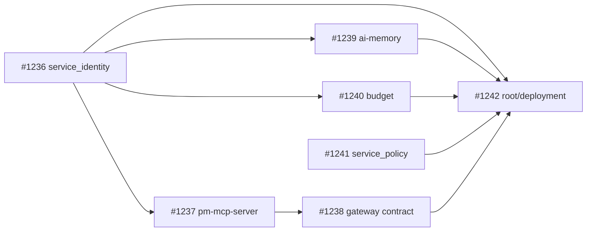

# AI-Assistant — полный cleanup и актуализация

> Статус: **утверждён, выполняется**
> Дата: 2026-07-15
> PM-MCP: координация — #1242; work items — #1236–#1241
> Область: `D:\GitHub\AI-Assistant`, кроме `assistant-ui/`

## 1. Контекст

План фиксирует результаты полного аудита монорепозитория и служит единым чек-листом
реализации. Аудит охватил runtime-код, contracts, SQLite lifecycle, security gates,
зависимости, документацию, deployment scripts и tracked-мусор. `assistant-ui/` исключён:
его код, тесты и локальная документация в этой работе не меняются.

Главный вывод: архитектурные границы проекта в целом уже сформированы, но после нескольких
миграций остались незавершённые хвосты. Наиболее существенные — provisioning ключей в
runtime hot path, незакрываемые SQLite connections, устаревший Gateway contract,
молчаливое принятие неизвестных полей PM-MCP, пустые registry domains, уязвимые версии
transitive dependencies и несинхронизированная документация.

## 2. Цель и ожидаемый результат

1. Упростить runtime-пути и убрать из них provisioning, subprocess и лишние записи на диск.
2. Завершить миграции без compatibility shims и удалить больше не поддерживаемые contracts.
3. Сделать resource lifecycle детерминированным, особенно для SQLite и stdio subprocess.
4. Включить единый Ruff security gate и устранить найденные реальные security issues.
5. Обновить lock-файлы с уязвимыми transitive dependencies.
6. Привести README, AGENTS, ARCHITECTURE и ADR-ссылки к фактическому текущему устройству.
7. Удалить tracked runtime/audit artifacts и прочий подтверждённый мусор.
8. Оставить проект в состоянии, где каждый поддерживаемый путь описан и проверяется тестами.

## 3. Ограничения и инварианты

- `assistant-ui/` не изменяется и не включается в verification scope.
- Имена файлов, модулей, функций и публичных identifiers не переименовываются без отдельного
  подтверждения пользователя.
- Новый путь сначала вводится и подключается, затем старый удаляется; временные fallback и
  compatibility shims в итоговом состоянии не остаются.
- Публичное поведение и команды запуска документируются в том же work item, где меняются.
- Удаление файла допускается только после поиска всех ссылок и exports по монорепозиторию.
- Существующие пользовательские изменения в рабочих деревьях не переписываются.
- Commit, push, branch и PR не входят в план без отдельного запроса пользователя.

## 4. Реестр находок

| ID | Приоритет | Находка | Evidence до изменений | Work item |
|---|---|---|---|---|
| F1 | Critical | `ensure_key_material()` вызывается из runtime token-provider путей. Повторный вызов запускает `whoami`/`icacls`, проверяет все subjects и перезаписывает public registry. Измеренный повторный вызов: примерно 123–180 ms; cached provider: примерно 0.005 ms. | `service_identity/config.py`, runtime provider factories в подсистемах | #1236, #1242 |
| F2 | Critical | Windows security utilities разрешаются через `PATH`; при service runtime под `LocalSystem` это создаёт риск запуска подменённого executable. | `service_identity/config.py` | #1236 |
| F3 | High | `tasks_db.initialize()` и `calendar_store.initialize()` возвращают raw SQLite connection; `with connection:` завершает transaction, но не закрывает connection. На Windows временная БД остаётся заблокированной до GC. Найдено 38 call sites. | `pm-mcp-server/app/tasks_db.py`, `pm-mcp-server/app/calendar_store.py`, callers | #1237 |
| F4 | High | Gateway всё ещё рекламирует и передаёт `related_goals`, хотя unified WorkItem contract после ADR-0026 это поле удалил, а `create_task` его не принимает. | `gateway/gateway/backends.py`, schemas/docs | #1238 |
| F5 | High | `update_task` фильтрует неизвестные поля, может выполнить no-op, но сообщает об успехе и публикует событие. Ошибки клиента маскируются как успешное изменение. | `pm-mcp-server` task update path | #1237 |
| F6 | High | Registry domains `budget` и `gmail` всегда возвращают пустой список, но продолжают рекламироваться как рабочие источники. | `pm-mcp-server/app/registry.py` и domain adapters | #1237 |
| F7 | High | PM-MCP memory integration поднимает отдельный stdio process на каждый вызов; составной search делает два последовательных процесса. Измеренный PM path: примерно 6.1–6.7 s, прямой тёплый search: примерно 2.0–2.6 s. | `pm-mcp-server/app/memory_client.py` | #1237 |
| F8 | High | Dependency audit: `ai-memory` фиксирует `setuptools 81.0.0` с PYSEC-2026-3447; исправление доступно с 83.0.0. | `ai-memory/uv.lock` | #1239 |
| F9 | High | Dependency audit: PM-MCP фиксирует `httplib2 0.31.2` с PYSEC-2026-3444; исправление доступно с 0.32.0. | `pm-mcp-server/uv.lock` | #1237 |
| F10 | High | Budget разбирает полученный извне XML стандартным `xml.etree.ElementTree`, без hardened parser/лимитов. | `budget/` FX import path | #1240 |
| F11 | Medium | Ruff security rules `S` применяются непоследовательно; часть production findings не попадает в quality gate. | subsystem `pyproject.toml` | #1236–#1241 |
| F12 | Medium | В PM-MCP остались broad `except` с `continue`, способные скрывать повреждённые records и реальные runtime ошибки. | `pm-mcp-server/app/` | #1237 |
| F13 | Medium | В AI-memory остались dead code, неподдерживаемый `chat_message` kind и historical/future docs, противоречащие уже работающему daemon rollout. Живая конфигурация подтвердила, что защищённый stdio bridge остаётся текущим Codex/Claude entrypoint и удалению не подлежит. | `ai-memory/AGENTS.md`, README/ARCHITECTURE, runtime config, related modules | #1239 |
| F14 | Medium | Deployment/runtime providers создаются повторно вместо одного process-scoped cached provider. | provider factories в `ai-memory`, `budget`, `pm-mcp-server`, `gateway` | #1236, #1237, #1239, #1240, #1242 |
| F15 | Low | Документация содержит устаревший `PM_MCP_GOALS_PATH`, live-goals модель, malformed/placeholder sections, duplicate Gateway bullet и старое описание Budget как read-only. | root/subsystem README, AGENTS, ARCHITECTURE, docs | #1237–#1242 |
| F16 | Low | В git отслеживаются audit/runtime artifacts: `.audit-scan.txt`, `tmp/pdfs/telc-b1-check/page.png` и тестовый `pm-mcp-public-audit.jsonl`. | repository index | #1242 |

## 5. Work packages и порядок выполнения

### WP-1 — Service identity runtime/provisioning boundary — #1236

- [x] Зафиксировать `ensure_key_material()` как явный provisioning API, не предназначенный
  для runtime hot path.
- [x] Сделать JSON/key writes атомарными и не менять файл при идентичном содержимом.
- [x] Запускать Windows utilities только по проверенному абсолютному пути из `System32`.
- [x] Кэшировать стабильные результаты provisioning-проверок внутри процесса, где это безопасно.
- [x] Перевести runtime provider factories на load-only путь и process-scoped cache.
- [x] Добавить regression tests: повторный ensure не перезаписывает registry; отсутствующий
  trusted executable приводит к fail-closed; runtime provider не провижнит ключи.
- [x] Включить Ruff `S` с точечными, объяснёнными исключениями только для тестовых `assert`.

Готовность: ни один request/tool hot path не вызывает provisioning или ACL subprocess;
explicit provisioning остаётся идемпотентным и проверяемым.

### WP-2 — PM-MCP lifecycle и contracts — #1237

- [x] Ввести единый context-managed SQLite connection API и перевести все call sites.
- [x] Подтвердить закрытие connections тестом, который удаляет/переименовывает temp DB на Windows.
- [x] Отклонять неизвестные update fields и no-op update; не публиковать ложное событие изменения.
- [x] Удалить пустые `budget`/`gmail` registry domains и все их advertised contracts/docs.
- [x] Свести memory search к одному stdio session/process на логическую операцию; удалить dead write helpers.
- [x] Обновить `httplib2` до исправленной версии и пересобрать lock-файл.
- [x] Заменить broad silent exceptions на наблюдаемую и контрактно корректную обработку.
- [x] Удалить live-goals/`PM_MCP_GOALS_PATH` legacy из кода, конфигурации и документации.
- [x] Исправить `ARCHITECTURE.md`, placeholder description и module map.

Готовность: SQLite ресурсы закрываются детерминированно, неизвестный contract не принимается,
registry рекламирует только реальные domains, memory operation не плодит лишние процессы.

### WP-3 — Gateway contract cleanup — #1238

- [x] Удалить `related_goals` из schema, mapping, fixtures и документации.
- [x] Добавить contract regression test против актуального PM-MCP `create_task` payload.
- [x] Убрать duplicate/stale documentation fragments.

Готовность: Gateway и PM-MCP используют один актуальный WorkItem contract без мёртвых полей.

### WP-4 — AI-memory cleanup и dependency security — #1239

- [x] Сохранить активный защищённый stdio bridge; удалить historical/future legacy docs и
  неподдерживаемый `chat_message` kind из project rules.
- [x] Удалить подтверждённый dead code после поиска imports/exports/tests.
- [x] Перевести service token provider на load-only cached runtime path.
- [x] Обновить `setuptools` до исправленной версии и пересобрать lock-файл.
- [x] Включить/вычистить Ruff `S`, не подавляя production findings глобально.
- [x] Синхронизировать README, AGENTS и ARCHITECTURE с текущим daemon/stdio contract.

Готовность: dependency audit чист по известной уязвимости, docs описывают только текущий путь,
runtime не провижнит service identity.

### WP-5 — Budget FX hardening — #1240

- [x] Заменить небезопасный XML parse на поддерживаемый hardened parser либо ввести строгие
  size/depth/entity limits без нового лишнего framework.
- [x] Добавить malicious/oversized XML regression tests.
- [x] Перевести service token provider на load-only cached runtime path.
- [x] Включить Ruff `S` и устранить реальные findings.
- [x] Обновить документацию только если изменится публичный error/limit contract.

Готовность: внешний XML fail-closed, штатный FX import не меняет результат.

### WP-6 — `service_policy` quality gate — #1241

- [x] Включить Ruff `S` и точечные test-only exceptions.
- [x] Исправить production findings и добавить недостающие regression tests.

Готовность: `service_policy` проходит единый security lint без широких suppressions.

### WP-7 — Root deployment, docs и tracked hygiene — #1242

- [x] Перевести deployment/runtime wiring на явное provisioning перед стартом и load-only providers.
- [x] Проверить оба поддерживаемых Windows start-path и актуальные NSSM contracts.
- [x] Обновить root README/AGENTS/docs: Budget не read-only, goals legacy отсутствует,
  актуальные subsystem boundaries и команды совпадают с кодом.
- [x] Перед удалением найти все ссылки на `.audit-scan.txt` и
  `tmp/pdfs/telc-b1-check/page.png`; затем удалить подтверждённые artifacts и добавить
  корректные ignore patterns, если источник генерации остаётся.
- [x] Выполнить финальный repository-wide поиск legacy terms, dead paths и абсолютных путей.

Готовность: deployment воспроизводим, root docs не противоречат subsystem docs, tracked-мусора нет.

## 6. Зависимости выполнения



Практический порядок: `#1236` → `#1237` → `#1238` → `#1239` → `#1240` → `#1241` → `#1242`.
Независимые проверки допускаются раньше, но одновременно в статусе `В работе` остаётся одна задача.

## 7. Матрица проверок

Для каждого изменённого Python subsystem:

```powershell
uv --cache-dir .uv-cache run ruff check .
uv --cache-dir .uv-cache run pytest
```

Дополнительные gates:

| Scope | Проверка |
|---|---|
| `service_identity` | unit tests атомарной записи, trusted `System32`, no-runtime-provisioning |
| `pm-mcp-server` | SQLite close/delete regression, update contract tests, registry/memory client tests |
| `gateway` | Gateway→PM payload contract test и отсутствие `related_goals` по `rg` |
| `ai-memory`, `pm-mcp-server` | dependency audit после lock refresh |
| `budget` | valid/malicious/oversized FX XML tests |
| root | существующий aggregate verifier, если присутствует; `git diff --check` |
| docs/legacy | repository-wide `rg` по удалённым env vars, fields, domains и paths |
| scope | `git status --short` и подтверждение отсутствия изменений в `assistant-ui/` |

Если полный subsystem suite выявит заранее существующий unrelated failure, он фиксируется
отдельно с точным command/output и не маскируется как успех текущего work item.

## 8. Риски и способы контроля

| Риск | Контроль |
|---|---|
| Удаление runtime provisioning ломает fresh install | Explicit provisioning остаётся первым шагом deployment; тестируется fresh temp root. |
| Context-manager migration меняет transaction semantics | Сначала сохранить commit/rollback contract тестами, затем механически перевести callers. |
| Удаление registry domains ломает скрытого потребителя | До удаления выполнить repo-wide search и проверить live contract; fallback не оставлять. |
| Lock refresh приносит широкий dependency diff | Обновлять только уязвимую dependency и необходимый resolver closure; проверить полный suite. |
| Ruff `S` создаёт шум | Исправлять production findings; suppressions — только узкие, с причиной. |
| Docs снова расходятся с runtime | Финальный cross-doc sweep и source-command-cleanup-check после всех work items. |

## 9. Общие критерии приёмки

- [x] Все задачи #1236–#1242 находятся в `Готово` с verification evidence.
- [x] Нет изменений под `assistant-ui/`.
- [x] Нет runtime-вызовов `ensure_key_material()`.
- [x] Все SQLite connections PM-MCP имеют явного владельца и детерминированное закрытие.
- [x] `related_goals` удалён из активных contracts, live-goals env/config и пустые registry domains полностью удалены.
- [x] Dependency audit не сообщает PYSEC-2026-3447 и PYSEC-2026-3444.
- [x] Ruff `S` включён во всех затронутых Python packages без global production suppression.
- [x] Relevant Ruff/pytest/aggregate gates зелёные; warnings отделены от failures.
- [x] README, AGENTS, ARCHITECTURE и ADR-ссылки описывают только текущую реализацию.
- [x] Подтверждённый tracked-мусор удалён после reference sweep.
- [x] В финальном diff нет случайных файлов, hardcoded absolute paths или пользовательских изменений.
- [x] Для каждого subsystem записан итоговый AI-memory `change`; план готов к архивации только
  после закрытия задач и отсутствия уникальных незавершённых критериев.

## 10. Pre-close engineering retrospective

Перед закрытием #1242 зафиксировать по каждой оси один verdict:

| Ось | Предварительный verdict | Условие пересмотра |
|---|---|---|
| `tech-stack-choices.md` | `no-change` | Если hardened XML или lifecycle pattern образует новый повторяемый brick — вынести follow-up после подтверждения пользователя. |
| Design-system | `no-change` | UI исключён из scope. |
| Skills | `no-change` | Если cleanup выявит повторяемый пробел текущих review/verify skills — предложить отдельный follow-up. |
| Hooks | `no-change` | Если тот же legacy/artifact regression нельзя надёжно ловить существующим CI/verify — предложить deterministic guard отдельной задачей. |

Общие rules, bricks, skills и hooks не меняются автоматически: любое такое расширение требует
отдельного подтверждения пользователя.

## 11. Журнал выполнения

### 2026-07-15 — #1236, `service_identity`

- Реализованы атомарные записи без перезаписи идентичного содержимого.
- `whoami.exe` и `icacls.exe` разрешаются только из абсолютного `System32`; некорректный
  `SystemRoot` и отсутствие executable дают fail-closed ошибку.
- `ServiceTokenProvider.from_files()` зафиксирован и протестирован как load-only путь.
- Middleware больше не полагается на отключаемые Python `assert` для security invariants и
  отклоняет некорректный `AuthDecision` с 403.
- Ruff `S`: зелёный; pytest: 16 passed; `git diff --check`: зелёный.
- Runtime call sites будут переведены на process-scoped providers в #1237, #1239, #1240 и #1242;
  поэтому общий критерий «нет runtime-вызовов `ensure_key_material()`» остаётся открытым.

| Ось ретроспективы #1236 | Verdict | Обоснование |
|---|---|---|
| `tech-stack-choices.md` | `no-change` | Применён существующий brick #26 Ruff `S`; новая технология не вводилась. |
| Design-system | `no-change` | Изменения только в backend security/package code. |
| Skills | `no-change` | Текущие review, migration и verification skills покрыли работу. |
| Hooks | `no-change` | Регрессии детерминированно покрыты Ruff и unit tests; новый hook не нужен. |

### 2026-07-15 — #1237, `pm-mcp-server`

- `tasks_db.initialize()` и `calendar_store.initialize()` стали владеющими context managers:
  transaction semantics сохранены, connections всегда закрываются; Windows
  regression tests удаляют temp DB сразу после выхода.
- `update_task` fail-closed отклоняет неизвестные поля и no-op updates; ложные
  update events не публикуются.
- Удалены пустые Gmail/Budget registry adapters, их domains, tests и advertised docs;
  registry теперь принимает только `project_tasks`, `todoist`, `calendar`, `obsidian`.
- AI-memory integration стала read-only: удалены dead write helpers и лишний
  preliminary process; одна логическая search-операция выполняет один MCP call.
- Удалены dead `unified_tree_import.py` и live-goals хвосты; legacy `related_goals`
  сохранён только в одноразовой SQLite migration для старых баз и не принимается API.
- Runtime Budget client и MCP integration tests переведены с deprecated
  `streamablehttp_client` на `streamable_http_client`; provider load-only и кэшируется.
- `httplib2` обновлён с 0.31.2 до 0.32.0; `httpx2` добавлен как dev client,
  требуемый текущим Starlette; `pip-audit` не нашёл известных уязвимостей.
- Ruff `S` включён; Todoist URL/path, SQL construction и middleware security invariants
  переведены на строгие allowlists и fail-closed обработку.
- Документация описывает текущую registry/module map; placeholder и malformed Markdown
  удалены.
- Verification: Ruff — зелёный; pytest — 272 passed без warnings; `uv lock --check` —
  зелёный; `pip-audit` — no known vulnerabilities; `git diff --check` — зелёный.

| Ось ретроспективы #1237 | Verdict | Обоснование |
|---|---|---|
| `tech-stack-choices.md` | `no-change` | Применены существующие SQLite/context manager, FastAPI/MCP и Ruff security bricks; новый общий brick не вводился. |
| Design-system | `no-change` | UI и `assistant-ui` исключены из scope. |
| Skills | `no-change` | Review, migration, security и verification workflows покрыли изменения. |
| Hooks | `no-change` | Contract/resource regressions покрыты unit/integration tests и Ruff; новый deterministic hook не нужен. |

### 2026-07-15 — #1238, `gateway`

- `related_goals` удалён из MCP input schema и `openapi.yaml`; Gateway больше не
  рекламирует поле, удалённое ADR-0026 из PM-MCP `create_task`.
- WorkItem domain enums синхронизированы с #1237: остались `project_tasks`,
  `todoist`, `calendar`, `obsidian`; пустые `budget`/`gmail` не попадают в OpenAPI и MCP.
- Contract test читает фактическую AST-сигнатуру `pm-mcp-server.create_task` и
  проверяет, что все advertised Gateway arguments принимаются upstream; OpenAPI и
  generated MCP schema используют один набор полей.
- В `ARCHITECTURE.md` удалён дублирующий оборванный Budget routing bullet.
- Ruff `S` включён: production `assert` в MCP backend loop заменён на явную
  fail-closed ошибку; OAuth auth-method literals централизованы; ложные
  secret/loopback findings имеют узкие объяснённые suppressions.
- Windows integration fixture сохраняет `SystemRoot` при isolated env, чтобы trusted
  System32 provisioning из #1236 проверялся реально, а не отключался в тесте.
- Verification: Ruff — зелёный; pytest — 63 passed; `uv lock --check` — зелёный;
  `pip-audit` — no known vulnerabilities; `git diff --check` — зелёный.
- Эфемерный Gateway runtime покрыт HTTP/MCP tests. Применение к установленному
  Windows service и live-schema probe остаются в deployment package #1242.

| Ось ретроспективы #1238 | Verdict | Обоснование |
|---|---|---|
| `tech-stack-choices.md` | `no-change` | Новая технология не вводилась; contract test использует Python AST и существующий Ruff security brick. |
| Design-system | `no-change` | UI и `assistant-ui` исключены из scope. |
| Skills | `no-change` | Migration, security review и verification workflows покрыли контрактную миграцию. |
| Hooks | `no-change` | Drift теперь ловится детерминированным contract test; новый hook не нужен. |

### 2026-07-15 — #1239, `ai-memory`

- Живая Codex-конфигурация и PM-MCP runtime wiring подтвердили, что `server.py` —
  действующий защищённый stdio bridge, а не legacy. План скорректирован по runtime evidence:
  bridge сохранён, historical/future описания завершённого rollout удалены.
- Из project rules удалён неподдерживаемый `chat_message`; canonical taxonomy во всех
  активных docs/code содержит только `fact`, `decision`, `task_context`, `change`, `note`.
- После repo-wide reference sweep удалены девять неиспользуемых symbols/обёрток, включая
  `MemoryEntry`, `readonly_connect`, proposal URL/tool helpers и redundant config wrapper;
  Vulture с confidence 90 не нашёл новых high-confidence кандидатов.
- PM-MCP client и stdio bridge больше не вызывают provisioning: заранее подготовленная
  service identity загружается load-only и кешируется по identity-конфигурации процесса.
- Ruff `S` включён для production; SQL/loopback/subprocess suppressions узкие и имеют
  локальное обоснование. Security invariants proposal middleware переведены с `assert` на
  явный fail-closed 403; отдельный Bandit scan зелёный.
- `setuptools` обновлён с 81.0.0 до 83.0.0. Resolver closure потребовал `torch 2.13.0`,
  потому что `torch 2.11/2.12` требуют `setuptools<82`; полный retrieval/test suite прошёл.
  `httpx2` убрал Starlette TestClient deprecation, а naive `datetime.utcnow()` заменён
  timezone-aware расчётом.
- README, AGENTS, ARCHITECTURE и `docs/RUNTIME.md` описывают действующий daemon, stdio
  bridge, local fallback и актуальный `AI_MEMORY_RUNTIME_PROFILE=deploy-service`.
- Verification: Ruff — зелёный; pytest — 338 passed и 25 subtests без warnings;
  Bandit — зелёный; `uv lock --check` — зелёный; `pip-audit` — no known vulnerabilities;
  `git diff --check` — зелёный.

| Ось ретроспективы #1239 | Verdict | Обоснование |
|---|---|---|
| `tech-stack-choices.md` | `no-change` | Применены существующие uv, Ruff security и cached-provider patterns; новый общий brick не вводился. |
| Design-system | `no-change` | UI и `assistant-ui` исключены из scope. |
| Skills | `no-change` | Review, migration, security и verification workflows покрыли cleanup. |
| Hooks | `no-change` | Dead paths и contract drift закрыты tests, Ruff/Bandit и dependency audit; новый hook не нужен. |

### 2026-07-15 — #1240, `budget`

- CBR/NBU responses ограничены 256 KiB; CBR XML отклоняет DTD/entity declarations,
  неожиданный root, глубину больше 8, более 2048 элементов и слишком длинный text/tail.
  Ошибочные XML/JSON/numeric payloads нормализуются в `FxRateError` и не кешируются.
- Сохранена доменная семантика FX: факты используют официальный курс строго на дату
  операции, планы — последний официальный курс на сегодня.
- Runtime provisioning service identity удалён из daemon и task-sync path. Один load-only
  provider кешируется на процесс; PM-MCP transport переведён на актуальный
  `streamable_http_client` с явным `httpx.AsyncClient`.
- Ruff `S` включён. SQL suppressions оставлены только локально для фиксированных колонок и
  сгенерированных `?`-плейсхолдеров. Vulture отметил лишь обязательные сигнатуры Pydantic
  validators (`cls`/`__context`), поэтому код не удалялся.
- README, AGENTS, ARCHITECTURE и `docs/RUNTIME.md` синхронизированы с FX limits,
  load-only identity и удалением PM-MCP `finance_stub`.
- Verification: Ruff — зелёный; targeted tests — 8 passed; полный pytest — 111 passed,
  включая subprocess `/healthz` smoke; `uv lock --check` — зелёный; `pip-audit` —
  no known vulnerabilities; `git diff --check` — зелёный.

| Ось ретроспективы #1240 | Verdict | Обоснование |
|---|---|---|
| `tech-stack-choices.md` | `no-change` | Использованы stdlib bounded XML и существующие bricks Ruff `S`/cached provider; новая dependency для XML не нужна. |
| Design-system | `no-change` | UI и `assistant-ui` исключены из scope. |
| Skills | `no-change` | Migration, security и verification workflows покрыли работу. |
| Hooks | `no-change` | FX payload limits, provider lifecycle и SQL assumptions покрыты tests/Ruff; новый hook не нужен. |

### 2026-07-15 — #1241, `service_policy`

- Ruff `S` добавлен в единый package gate; исключение ограничено pytest `assert` (`S101`)
  только под `tests/**`. Production security findings после включения отсутствуют.
- Исправлен fail-open edge case: явно переданный пустой Gateway allowlist больше не
  подменяется глобальным allowlist и корректно отклоняет любой route.
- Добавлен regression test deny-all поведения; Vulture не нашёл high-confidence dead code.
- Verification: Ruff — зелёный; pytest — 29 passed; `uv lock --check` — зелёный;
  `pip-audit` — no known vulnerabilities (только informational warnings по metadata
  сторонних packages); `git diff --check` — зелёный.

| Ось ретроспективы #1241 | Verdict | Обоснование |
|---|---|---|
| `tech-stack-choices.md` | `no-change` | Применён существующий brick #26 Ruff `S`; dependencies и architecture не менялись. |
| Design-system | `no-change` | Изменения относятся только к backend policy package. |
| Skills | `no-change` | Security review и verification workflows покрыли scope. |
| Hooks | `no-change` | Регрессия детерминированно покрыта unit test и не требует общего hook. |

### 2026-07-15 — #1242, root deployment/docs/hygiene

- `register_services.ps1` теперь всегда выполняет explicit reconcile полного
  service-identity набора до service wiring. Идентичные keys/registries не переписываются,
  недостающие восстанавливаются; custom identity paths передаются и provisioning, и каждому
  caller runtime. `PM_MCP_GOALS_PATH` удалён из NSSM environment и operator docs.
- Direct registration проверен через безопасный `-WhatIf`; one-shot bootstrap — через
  `-WhatIf` и contract tests общего registration path. Оба пути используют шесть NSSM
  services с `SERVICE_AUTO_START`. Read-only live status: все шесть служб `Running` /
  `Automatic`, PM-MCP и Assistant-UI отвечают 200, Gateway — ожидаемым protected 401.
- Root README актуализирован: текущий Budget MCP contract, Python/service runtime,
  `uv sync --dev`, explicit provisioning и security gates; historical migration section
  удалён. Stale `GHSA-rrmf-rvhw-rf47` suppression удалён из CI после чистого audit.
- После reference sweep удалены `.audit-scan.txt`, личный
  `tmp/pdfs/telc-b1-check/page.png` и тестовый
  `pm-mcp-server/data/logs/pm-mcp-public-audit.jsonl`. `.gitignore` и project
  sensitive-file guard предотвращают повторное попадание этих классов artifacts.
- Активный legacy sweep чист. `ensure_key_material()` остался только в explicit install
  provisioning; `related_goals` — только в закрывающей старую schema migration и
  regression test отклонения старого API field, не в runtime contract.
- Installed NSSM configuration не перезаписывалась и службы не перезапускались: это требует
  elevated PowerShell. Воспроизводимость registration подтверждена без системных mutations.
- Финальная verification: Ruff и lock check зелёные для шести затронутых packages;
  pytest — 16 + 272 + 63 + 338 (и 25 subtests) + 111 + 29 passed; root tools —
  19 passed; `uv audit --locked` без suppressions — no known vulnerabilities;
  sensitive-file guard, YAML parse, PowerShell parse и `git diff --check` — зелёные.
- Все задачи #1236–#1242 подтверждены в `Готово`; итоговые AI-memory changes:
  #2567, #2568, #2569, #2570, #2571, #2572 и portfolio summary #2573.

| Ось ретроспективы #1242 | Verdict | Обоснование |
|---|---|---|
| `tech-stack-choices.md` | `no-change` | Использованы текущие NSSM, uv audit, Ruff security и explicit provisioning bricks; новый общий brick не появился. |
| Design-system | `no-change` | `assistant-ui` и UI-код исключены из scope. |
| Skills | `no-change` | Существующие onboarding, review, migration, security и verification workflows покрыли cleanup. |
| Hooks | `no-change` | Общие hooks не менялись; одобренный project-local sensitive-file guard расширен внутри #1242 и покрыт тестами/CI. |
